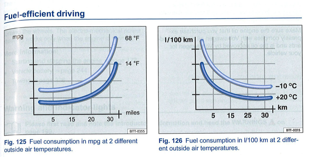

This pair of figures is from a section of a user manual for a Volkswagen Jetta 
blaming the driver for bad fuel efficiency. 
These graphs have four conceptually different flaws, three of which are grievous. 

See how many flaws you can find!

