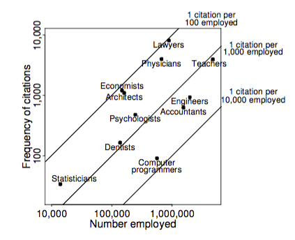

The article
Let's Practice What We Preach: Turning Tables into Graphs.[PDF](http://www.stat.columbia.edu/~gelman/research/published/dodhia.pdf)
The American Statistician, Volume 56, Number 2, 1 May 2002 , pp. 121-130(10).

contains the following graphic: 

The graphic plots the number of citations for a handful of professions vs the number of individuals employed.

Reproduce this graphic.
